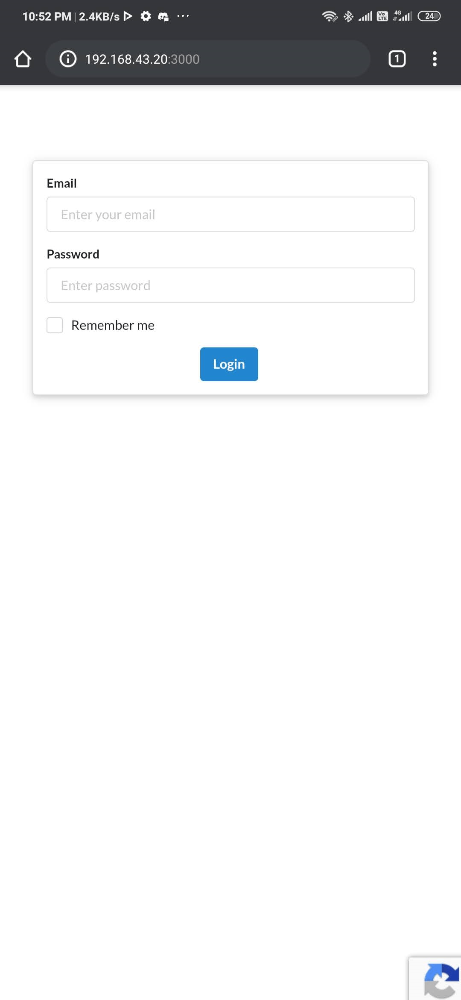
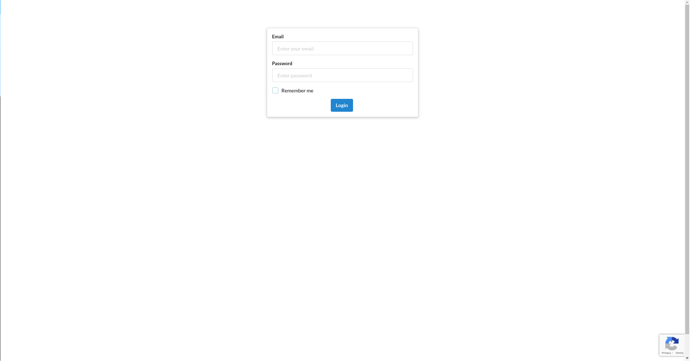

# Rinku-Frontend

> Create/manage download links for filesystems, Re-captcha, analytics & download log for files & Downloaded files.

[![release][badge]][release link] [![license][license-badge]][license file]

[license-badge]: https://img.shields.io/github/license/aghontpi/Rinku-Frontend?style=flat-square
[license file]: https://github.com/aghontpi/Rinku-Frontend/blob/master/LICENSE
[badge]: https://img.shields.io/github/v/release/aghontpi/Rinku-Frontend?include_prereleases&style=flat-square
[release link]: https://github.com/aghontpi/Rinku-Frontend/releases

## Features

- Create download link for any files
- Manage all the download links
- Download page for files is seperate
- Get analytics of the download statistics
- Includes google Recaptcha (configurable, can be turned off/on)
  - Removed (google recaptcha from frontend implemnentation after v2.x)
- Get log of download files

## [Backend](https://github.com/aghontpi/Rinku-Backend/) PHP, (Written from Scratch)

## Preview

### mobile

<p align="center">
  
</p>

### pc

<p align="center">
  
</p>

## userStories

- only allowed users(login) can use all features except download
- create download link for any files in the server
- manage all download links
- get analytics of the downloaded files(chart)
- has google Re-captcha support to prevent bots,
  - Re-captcha is configurable, can be turned off/on
- get logs of download files(user agent, ip, download time,...etc)
- have a totally separate download page that has no authentication(but has recaptcha)

## Folder Structure

| Name                    | Description                                                                                |
| ----------------------- | ------------------------------------------------------------------------------------------ |
| **src**                 | Source files for server                                                                    |
| **src/public**          | Static files to be used on client side                                                     |
| **src/Saga/**           | Redux-Saga files                                                                           |
| **src/Saga/network.ts** | Server Communication logic                                                                 |
| **src/Store/**          | Redux/Redux-toolkit files                                                                  |
| **src/Hooks/**          | Custom hooks                                                                               |
| **src/Containers/**     | Every page for the app                                                                     |
| **src/Components/**     | Common components for the whole app                                                        |
| **src/Route/**          | All Route config                                                                           |
| **src/Utils/**          | Common logic throught the whole app                                                        |
| **src/Style/**          | Style and assests, since create-react-app does not allow files outside src/ to be imported |
| **.env.development**    | Development variables, configuring backend, etc.                                           |
| **.env.production**     | Development variables but for production                                                   |

## File-naming

- store files are named \*.store.ts
- saga files are named \*.saga.ts
- hook files are named \*.hook.ts

## Built with

- React
- React router
- Typescript
- Redux
- Redux-toolkit
- Redux-Saga
- semnatic ui
- nivo

## Development Status

[Scrum](https://trello.com/b/6ntSZ7Yw/rinku)

## Start Developing

```bash

yarn

yarn start

```

## Start build

```bash

yarn run build

```
